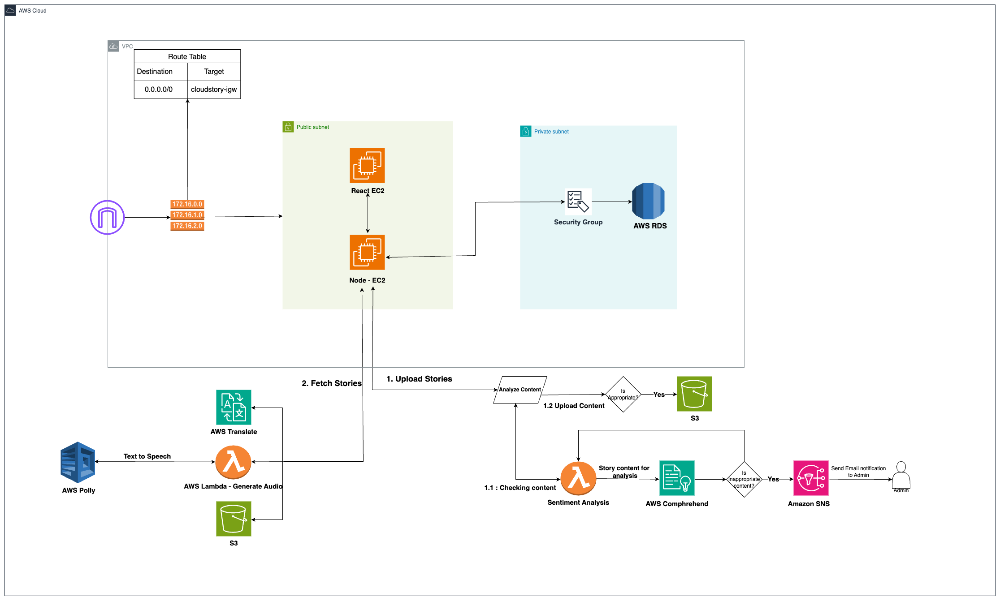

## CloudStory

### Introduction

CloudStory is an innovative online platform designed to bring stories to life
for children around the world. This platform allows authors to publish their
stories, with images. The core functionality of CloudStory includes:
multilingual support and audio narration

### Cloudformation Demostration

https://youtu.be/FySZOPLgPRg

### Features

- Authors can upload stories which are appropriate for children.
- Story content can contain text and in between images, which will be stored with a rich text editor
- Admin will be notified in-case inappropriate content has been
uploaded by authors.
- Children will be able to read the stories in multiple languages they
want, by just choosing the preferred language from the top right bar.
- Children will also be able to listen to the story, in their preferred
language by clicking on the audio button in the story detail page.

### Target Users

- Authors: Individuals who want to share their stories with a global
audience.
- Children: The primary audience who will read and listen to the stories.

### Techstack

- Frontend : React jS with react-bootstrap Deployed on EC2
- Backend : Node jS + typescript + TypeORM, Deployed on EC2
- Database: MySQL with RDS
- Language translation: AWS Translate
- Sentiment Analysis: Amazon Comprehend
- Text to Speech: Amazon Polly
- Storing story Images: Amazon S3 (Simple Storage Service)

### Project Architecture

